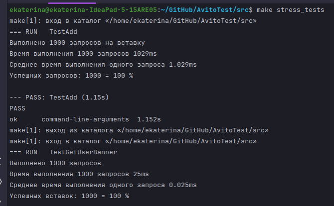
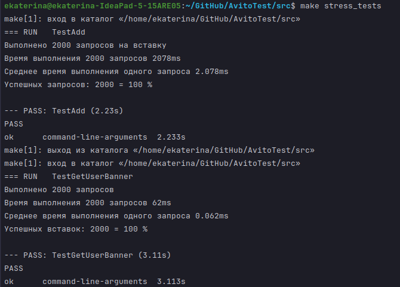

# Тестовое задание для стажёра Backend (язык Go)

# Оглавление

- [Запуск](#запуск)
    - [Локально](#локально)
    - [Запуск в docker](#запуск-в-docker)
    - [Запуск тестов](#запуск-тестов)
        - [Инструкция по запуску тестов](#инструкция-по-запускку-тестов)
- [Описание работы](#описание-работы)
    - [Организация базы данных](#организация-базы-данных)
- [Что реализовано](#что-реализовано)
    - [Дополнительные задания](#дополнительные-задания)
- [Нагрузочные тесты](#нагрузочные-тесты)
    - [1000 RPS](#1000-rps)
    - [2000 RPS](#2000-rps)
- [Примеры запросов](#примеры-запросов)
    - [POST /banner](#post-banner)
    - [GET /user_banner](#get-user_banner)
    - [GET /banner](#get-banner)
    - [DELETE /banner/{id}](#delete-bannerid)
    - [PATCH /banner/{id}](#patch-bannerid)


## Запуск
### Локально
```shell
make run
CTRL + C // для остановки сервера 
``` 
Сервер поднимется на ```lovalhost:8080```. Адрес сервера можно изменить в ```env``` файлах (о них ниже).
### Запуск в docker
```shell
make docker_build
make docker_up // docker compose up
make docker_down // docker compose down -- остановка контейнера
```
Возможно, для выполнения этих команд потребуются права суперюзера (```sudo```). При запуске в контейнере база данных 
будет храниться в папке ```data```. Для доступа к данным в ```data``` неоьходимо использовать права суперпользователя или 
сменить ей владельца, например, с помощью ```chown```, так как владельцем этой папки изначально будет являться рутпользователь.

### Запуск тестов
Для тестирования необходимо **удалить** **таблицы** ```data, banners``` из базы данныых. Столбец ```id``` баннеров - автоинкремент, поэтому если просто очистить таблицы, а затем заполнить заново, невозможно будет получить баннер с ```id = 1``` ( что требуется для тестов).
Тесты необходимо запускать в следующем порядке:
* Стресс тесты (как минимум, тест POST) для заполнения чистой базы данных
* E2E тесты, чтобы они запрашивали баннеры из заполненной базы данных\

#### Инструкция по запускку тестов
```shell
// После даления таблиц data, banners из базы данных
make run // поднять сервер
make stress_tests
make server_tests
```

Также каждый тест можно запустить отдельно командами: 
```shell
make test_stress_post
make test_stress_get_user_banner
make test_e2e_get_user_banner
make test_e2e_get_many_banners
make test_e2e_post
make test_e2e_delete
make test_e2e_patch
```


## Описание работы
Код сервера был сгенерирован из openapi файла командой
```shell
~/bin/openapitools/openapi-generator-cli generate -g go-server -i api/openapi.yaml -o restapi
```
Использована база данных Postgres, пакет ```gorm```. При запуске сервера, если таблиц нет, происходит автомиграция. 
Для подключения к базе данных используюся переменные окружения, определенные в файлах ```env/.env``` и ```env/.env_docker```.
В файлах ```.env (.env_docker)``` можно изменить логин/пароль пользователя базы данных.
Путь к этим файлам передается как флаг ```--config``` при запуске программы. При запуске из рабочей директрии могут быть использованы значения по умолчанию, нет необходимости явно передавать флаг.
Файл ```env/.env``` определяет переменные окружения для локального запуска, ```env/.env_docker``` -- для запуска в контейнере.

Для уменьшения времени ответа для часто запрашиваемых баннеров реализован кэш внутри памяти. Используется, если ```use_last_revisin = false```. Он может выдавать не актуальные данные, но обращение к нему быстрее, чем к базе данных. 
Периодичность очистки можно задать в файлах ```.env (.env_docker)```.

Логи записываются по умолчанию в ```logs/log.txt```, путь до логгера можно изменить в ```.env (.env_docker)```. Формат логов:
```
2024/04/14 18:48:46 POST /banner BannerPost 3.956927ms
```


### Организация базы данных
В базе данных 2 таблицы:
``` SQL
                                       Table "public.data"
   Column   |           Type           | Collation | Nullable |             Default              
------------+--------------------------+-----------+----------+----------------------------------
 id         | integer                  |           | not null | nextval('data_id_seq'::regclass)
 content    | json                     |           | not null | '{"key": "value"}'::json
 is_active  | boolean                  |           |          | false
 created_at | timestamp with time zone |           |          | 
 updated_at | timestamp with time zone |           |          | 
Indexes:
    "data_pkey" PRIMARY KEY, btree (id)

```

``` SQL
               Table "public.banners"
 Column  |  Type   | Collation | Nullable | Default 
---------+---------+-----------+----------+---------
 data_id | integer |           |          | 
 feature | integer |           |          | 
 tag     | integer |           |          | 
Indexes:
    "idx_banner_feature_tag" UNIQUE, btree (feature, tag)
```
```banners``` хранит информацию о том, какой ```id``` баннера соответвует каким парам фича-тэг. В таблице ```data``` хранится ```id```  и содержимое баннера.
Чтобы уникальность пар тэг-фича не нарушалась, в таблице ```banners``` создан индекс ```UNIQUE```. Для ускорения поиска по таблице ```data``` создан индекс на ```id```. ```EXPLAIN``` показал, что оба индекса работают.


## Что реализовано
Реализованы все обязательные требования, включая E2T тестирование.
Инструкция по запуску тестирования представлена ниже.
### Дополнительные задания
* Система адаптирована под увеличение RPS до 2000 и 3000.\
В случае получения из базы данных в целом запросы выполняются быстро (общее время с отправки первого запроса и до получения ответа последним, разделенное на кол-во запросов, получается в районе 10 миллисекунд), но время ответа на самые долгие запросы возрастает до 100-200 миллисекунд.
* Проведено нагрузочное тестирование, результаты здесь 
* Реализованы Е2Е тесты для всех запросов
* Статический анализ кода ```make check```


## Нагрузочные тесты
Запросы отправлялись с паузой в 1 мс с различными ```tag``` и ```future```. Успешными считались запросы с кодом ответа 200.
### ```1000 RPS```



### ```2000 RPS```


## Примеры запросов
### ```POST /banner```
```shell
curl -X POST "http://localhost:8080/banner" -H "Content-Type: application/json" -H "Token: admin_token" -d '{
"tag_ids": [1, 2, 3],
"feature_id": 1,
"content": '"{\"title\": \"some_title\", \"text\": \"some_text\", \"url\": \"some_url\"}"',
"is_active": true
}'
```
### ```GET /user_banner```
```shell
curl -X GET "http://localhost:8080/user_banner?tag_id=1&feature_id=8&use_last_revision=true" -H "Token: user_token"
```
### ```GET /banner```
```shell
curl -X GET "http://localhost:8080/banner?tag_id=123&limit=5&offset=1" -H "Token: admin_token"
```
### ```DELETE /banner/{id}```
```shell
curl -X DELETE "http://localhost:8080/banner/1" -H "Token: admin_token"
```
### ```PATCH /banner/{id}```
```shell
curl -X PATCH "http://localhost:8080/banner/10" -H "Content-Type: application/json" -H "Token: admin_token" -d '{
  "tag_ids": [31, 22],
  "content": '"{\"title\": \"some_title\", \"text\": \"some_text\", \"url\": \"some_url\"}"',
  "feature_id": 9
}'
```
